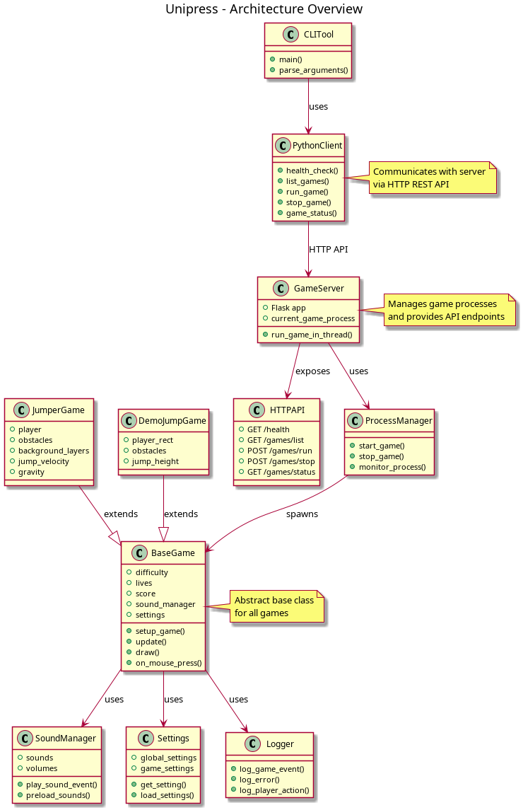
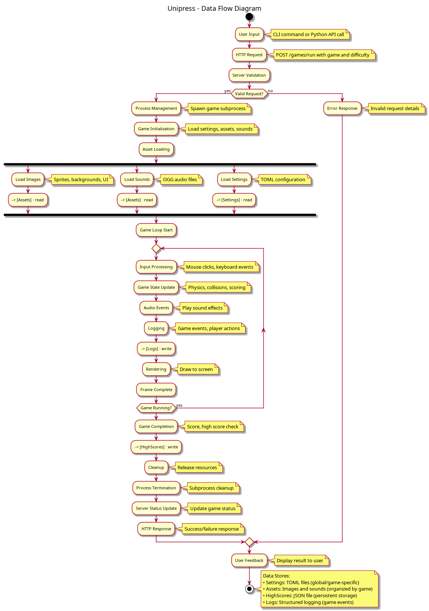

# System Architecture Overview

## Introduction

Unipress is designed as a modular, extensible framework for one-button games. The architecture follows modern Python development practices with clear separation of concerns, comprehensive configuration management, and robust asset handling.

## High-Level Architecture

The system consists of several key components:

### Core Framework
- **BaseGame**: Abstract base class providing common game functionality
- **AssetManager**: Centralized resource management for sprites, sounds, and animations
- **SoundManager**: Event-driven audio system with OGG format support
- **SettingsManager**: Hierarchical TOML-based configuration system
- **Logger**: Structured JSON logging with Loguru

### Game Layer
- **Game Implementations**: Concrete game classes extending BaseGame
- **Game Server**: HTTP API for game management within containers
- **High Scores**: Persistent score tracking with JSON storage

### Infrastructure
- **Containerization**: Docker with multi-stage builds and X11/audio passthrough
- **CI/CD**: GitHub Actions for automated testing and deployment
- **Documentation**: Sphinx with Read the Docs and GitHub Pages hosting

## Component Relationships


*High-level system architecture showing component relationships*

### Detailed Architecture

The system follows a layered architecture with clear separation of concerns:

```mermaid
graph TB
    A[Main Entry Point] --> B[BaseGame]
    B --> C[AssetManager]
    B --> D[SoundManager]
    B --> E[SettingsManager]
    B --> F[Logger]
    
    G[Game Implementations] --> B
    H[Game Server] --> B
    
    I[Container Runtime] --> G
    I --> H
    
    J[CI/CD Pipeline] --> K[Documentation]
    J --> L[Testing]
```

## Key Design Principles

### 1. One-Button Constraint
All games must work with single button input only. This constraint drives the entire architecture and ensures accessibility and simplicity.

### 2. Modularity
Each component is designed to be independent and replaceable. The BaseGame class provides a common interface while allowing for game-specific implementations.

### 3. Configuration-Driven
Settings are hierarchical and TOML-based, allowing for easy customization without code changes.

### 4. Asset Management
Centralized asset handling with JSON metadata for animations and structured organization by game and type.

### 5. Container-Ready
Full Docker support with proper audio and display passthrough for seamless deployment.

## Technology Stack

- **Language**: Python 3.12+
- **Game Framework**: Arcade
- **Package Manager**: uv
- **Configuration**: TOML
- **Logging**: Loguru (JSON format)
- **Audio**: OGG format with event-driven system
- **Containerization**: Docker with docker-compose
- **CI/CD**: GitHub Actions
- **Documentation**: Sphinx with Myst-Parser
- **Hosting**: Read the Docs + GitHub Pages

## Directory Structure

```
unipress/
├── core/           # Core framework components
├── games/          # Game implementations
├── assets/         # Centralized asset management
├── locales/        # Internationalization
├── ui/            # User interface components
├── docs/          # Documentation and ADRs
└── tests/         # Test suite
```

## Data Flow


*Data flow through the system components*

1. **Initialization**: Settings loaded, assets initialized, sound system started
2. **Game Loop**: Event handling, state updates, rendering, audio processing
3. **State Management**: Score tracking, lives system, game progression
4. **Persistence**: High scores saved, settings updated, logs written

## Security Considerations

- Container isolation for game execution
- Input validation and sanitization
- Secure configuration management
- Audit logging for debugging and monitoring

## Performance Characteristics

- 60 FPS target for smooth gameplay
- Efficient asset loading and caching
- Minimal memory footprint
- Fast startup times for containerized deployment

## Extensibility

The architecture is designed for easy extension:

- **New Games**: Implement BaseGame interface
- **New Assets**: Follow established naming conventions
- **New Features**: Extend core components without breaking existing games
- **New Platforms**: Container-based deployment supports multiple environments
